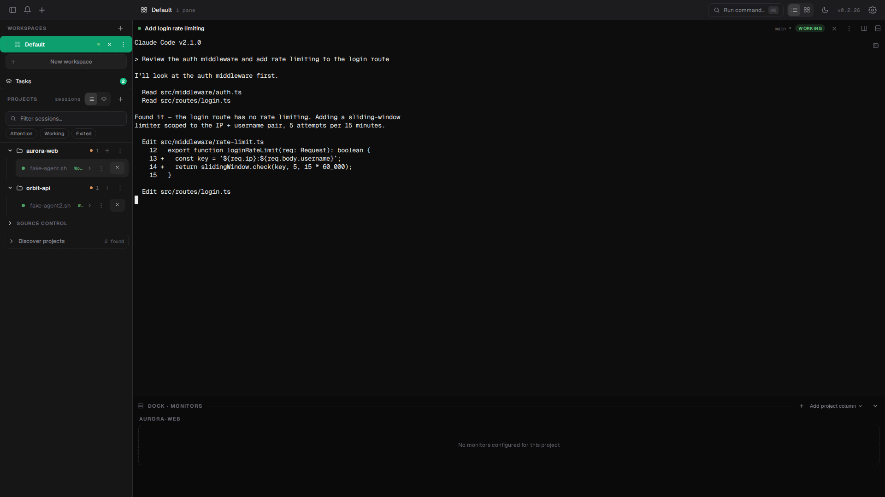
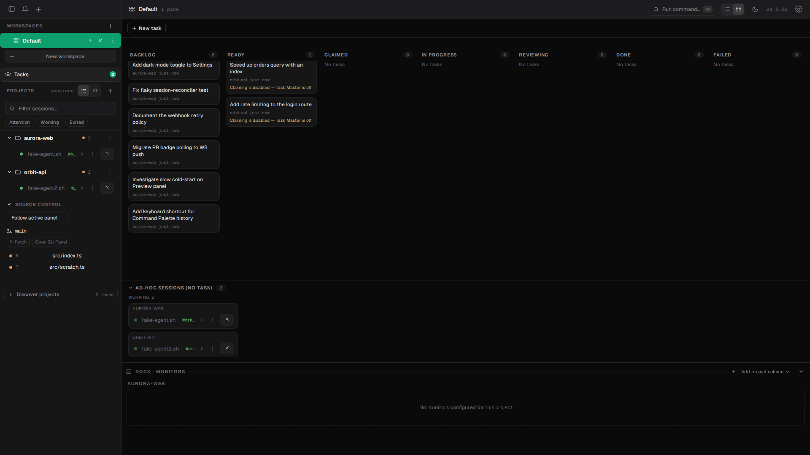

# Mullion

A self-hosted, tiled, persistent browser dashboard for host-run AI CLI
terminals (Claude Code, Codex, opencode, ...). Sessions run on the host under
`dtach`, so closing the browser tab never kills them — the dashboard is a thin
attach-client, not the process owner.

Backend: [Fastify](https://fastify.dev/) + TypeScript (ESM) +
SQLite/[Drizzle](https://orm.drizzle.team/), with security middleware and full
CI/CD. Frontend: React + [dockview](https://dockview.dev/) (tiled splits/tabs)

- [xterm.js](https://xtermjs.org/).

<p align="center">
  
  
</p>

## ✨ Features

- **Tiled.** A dockview-based split/tab layout turns the browser into mission
  control for however many terminals you're running at once — drag, split,
  and save named/grouped workspace layouts instead of juggling browser tabs.
- **Persistent.** Every session is a host PTY attached via `dtach`, running
  inside a transient `systemd --user` scope. Sessions survive redeploys,
  service restarts, and closed browser tabs — the dashboard reattaches to
  what's already running rather than owning the process.
- **Mission control.** One dashboard for every host-run AI CLI: a
  command-palette launcher with official CLI logos, project discovery, a
  per-project dock (see [`docs/dock.md`](docs/dock.md)) with branch/worktree
  selection and optional live-sync preview worktrees, and session status
  signals (exited detection, activity/attention) so you always know what's
  running and what needs you.
- **Push notifications (mobile/background).** Install Mullion as a home-screen
  PWA and enable the Push toggle in Settings to get attention alerts even
  when the tab is closed or the phone is asleep — in addition to the
  existing in-tab browser/sound notifications. Requires a secure (`https://`)
  origin. **On iOS Safari, notification permission can only be granted from
  the installed home-screen app, never from a regular browser tab** — install
  first, then enable the toggle from there.
- **Per-session mute / do-not-disturb.** Silence a single noisy session —
  its OS desktop notification, sound, and in-app unread badge — without
  turning off notifications globally. Toggle it from the session tab's
  overflow menu or the session row's `…` menu; the preference is saved in
  this browser and survives reload/reconnect (timeline history and the
  notification feed are kept). Web-push to other devices is unaffected.
- **Voice dictation.** Hold or tap the mic button in a terminal pane (or the
  Ctrl+Shift+Space hotkey on desktop) to dictate into the CLI's prompt via
  your browser's speech engine — the transcript is inserted for you to
  review, never sent automatically. Requires a secure (`https://`) origin,
  and only works in browsers that expose the Web Speech API (Chrome and
  Safari today; the mic button is hidden automatically in Firefox, which
  doesn't). In Chrome, recognition audio is sent to Google's servers for
  transcription — worth knowing if you're self-hosting Mullion specifically
  to keep everything on your own infrastructure. This is distinct from, and
  doesn't require, any dictation feature built into the CLI itself (Claude
  Code's and Google Antigravity's own `/voice` can't reach a Mullion
  session's PTY — the microphone is on your device, the CLI runs on the
  Mullion host).
- **Multi-host.** Run sessions on more than one machine from a single
  dashboard — every other machine runs the same Mullion build, just started
  as an `agent` instead of the `primary`. See
  [`docs/multi-host.md`](docs/multi-host.md) for setup.
- **Browser previews.** Open a project's dev server — or any external URL —
  in a dockview panel next to your terminals, with working HMR, proxied
  same-origin so it isn't blocked as mixed content. Mullion also notices a
  dev server started by hand in a plain terminal and offers to wire it into
  the preview. See [`docs/browser-previews.md`](docs/browser-previews.md)
  for setup.
- **Browser automation & control.** Drive a project's Playwright-controlled
  Chromium browser programmatically via a REST API (navigate, click, fill,
  eval, snapshot, screenshot) or stream its interactive display over WebSockets.
  Import cookie profiles from Chrome/Firefox to start authenticated. See
  [`docs/browser-automation.md`](docs/browser-automation.md) for details.
- **GitHub integration.** Connect a PAT or GitHub OAuth device flow once,
  and any project with a github.com `origin` gets a Dock status widget and
  panel for open issues/PRs and Actions/CI status — with optional webhook-
  driven real-time CI updates, plus an opt-in GitHub App for repo-scoped,
  short-lived installation tokens on Task Master's own writes (see
  [`docs/github-integration.md`](docs/github-integration.md)).
- **Task Master.** Turn a labeled GitHub issue — or a task created directly
  on the board — into an autonomously-worked, reviewed, and promoted pull
  request: an agent claims it into an isolated worktree, works it, and a
  human decides whether to approve or send it back, with a configurable
  concurrency cap, time budget, and pause switch. Ingest is poll-driven by
  default, with optional webhook-driven ingest for near-real-time pickup.
  See [`docs/tasks.md`](docs/tasks.md) for the full design.
- **Optional in-process auth.** A shared-token gate and/or native OIDC login
  (e.g. against Authentik) — either or both, off by default, composable
  with (not a replacement for) an external forwardAuth gateway. See
  [`docs/auth.md`](docs/auth.md) for setup.
- **SSH agent access from a session.** Point `MULLION_SSH_AUTH_SOCK` at a
  unix socket implementing the SSH agent protocol — e.g. one forwarded in
  from a laptop's 1Password/`ssh-agent` via OpenSSH's native `ssh -R` unix-
  socket forwarding — and every session gets a working `SSH_AUTH_SOCK`
  without a private key ever touching this host. See
  [`docs/ssh-agent.md`](docs/ssh-agent.md) for setup.
- **Persistent, queryable session history (opt-in).** Turn on
  Settings' event-persistence toggle to mirror notification events to a
  durable `session_events` table (with configurable retention), queryable
  via `GET /api/events`, the control socket's `events.query` op,
  `mullion history`, or the session timeline's own search — fleet-wide
  (cross-host) capture, not just the primary (see
  [`docs/socket-api.md`](docs/socket-api.md)/[`docs/cli.md`](docs/cli.md)).

## 📚 Documentation

See [`docs/README.md`](docs/README.md) for the full index: subsystem
deep-dives, the environment-variable reference, deployment, and the
`mullion` CLI / control socket / agent-hook surfaces. Contributing?
See [`CONTRIBUTING.md`](CONTRIBUTING.md).

## 🚀 Quick Start

```bash
make install          # install dependencies
cp .env.example .env  # configure environment (optional; defaults work)
make dev              # start backend (tsx watch) + frontend (Vite, HMR) together
```

`make dev` proxies the frontend's `/api` and `/ws` to the backend for you.
To run the frontend on its own instead: `cd frontend && npm install && npm run dev`.

Backend API smoke test:

```bash
curl localhost:3000/health
curl localhost:3000/ready
curl -X POST localhost:3000/api/projects -H 'content-type: application/json' \
  -d '{"name":"my-project","cwd":"/home/me/projects/my-project","createDir":true}'
curl localhost:3000/api/projects
```

`cwd` must already exist unless `createDir: true` is set, in which case only
the final path component is created (the parent directory must already
exist).

## 📁 Structure

See [`docs/architecture.md`](docs/architecture.md) for the full
plugins/routes/services tour.

## 🔧 Configuration

All config is validated at startup by `@fastify/env`. See
[`docs/configuration.md`](docs/configuration.md) for every variable, its
default, and what it does — this file used to carry its own copy of that
table; it's the single source now.

## 🛠️ Commands

Backend (repo root):

- `make install` / `make install-hooks` — install dependencies / pre-commit
  - pre-push git hooks
- `make dev` — backend + frontend dev servers together, with reload
- `make test` / `make lint` / `make typecheck` — Vitest / ESLint / `tsc`,
  across **both** the backend and `frontend/` workspaces
- `make test-backend` — Vitest, backend only (the fast inner loop)
- `make test-coverage` — Vitest with coverage, backend only
- `make test-e2e` — opt-in socket API e2e suite (real Unix sockets, a real
  spawned `mullion` CLI process, a real Chromium); not part of `make test`,
  but **is** its own job in CI — see [`test/e2e/README.md`](test/e2e/README.md)
- `make format` / `make format-check` — Prettier, repo-wide (covers
  `frontend/` too)
- `make build` — production build to `dist/`
- `make clean` — remove `node_modules`, `dist`, and caches
- `make help` — list every target (the `.DEFAULT_GOAL`)
- `npm run db:generate` — generate a migration from schema changes
- `npm run db:migrate` — apply migrations (also run automatically at startup)
- `npm run db:seed` — seed initial data

Frontend (`frontend/`):

- `npm run dev` — Vite dev server (proxies `/api`, `/ws` to the backend)
- `npm run build` — production build to `frontend/dist`
- `npm run lint` / `npm run typecheck` / `npm run test` / `npm run preview`

`mullion` CLI (see [`docs/cli.md`](docs/cli.md)):

- A versioned install links it at `~/.local/bin/mullion`
  (`deploy/install.sh`); from a source checkout, run it directly:
  `node src/cli/mullion.mjs <command>`.
- Session lifecycle, the full browser-automation surface, project/preview/
  dock management, event tailing, and notifications — all over the same
  local Unix control socket the frontend itself talks to
  ([`docs/socket-api.md`](docs/socket-api.md)), no HTTP base URL or bearer
  token required when run from inside a session.

## 🛡️ Security

- `@fastify/helmet` (security headers), `@fastify/rate-limit`, and
  `@fastify/cors` are wired into every app via `src/plugins/security.ts`.
- Optional AES-256-GCM encryption-at-rest via `DB_ENCRYPTION_KEY` (see the
  `users.notes` column for an example).
- CodeQL scanning and dependency review run in CI; `detect-secrets` runs
  pre-commit. Follows the
  [s3ntin3l8 Global Security Policy](https://github.com/s3ntin3l8/.github/blob/main/SECURITY.md).

## 🚢 Deploy

Mullion runs **natively on the host** under `systemd --user`, not in a
container — the app shells out to `systemd-run`/`systemctl` and `dtach` to
keep terminal sessions alive across redeploys, which a container lifecycle
can't guarantee. There is no Docker image; `deploy/install.sh` bootstraps a
fresh host into a versioned-release layout (fed by a CI-built release
tarball) with a `systemd --user` unit, and updates after that go through the
in-app Settings → Server info "Update now" button. This is fully supported,
not a stopgap: `deploy/` also has a Traefik dynamic-config router and an
Authentik forwardAuth reference — see
[`deploy/README.md`](deploy/README.md) for the full layout and install
steps.

## 📦 Releases

Automated via [Release Please](https://github.com/googleapis/release-please).
Use [Conventional Commits](https://www.conventionalcommits.org/) to trigger
version bumps.

## 🙏 Credits

The session launcher's CLI logos are sourced from
[homarr-labs/dashboard-icons](https://github.com/homarr-labs/dashboard-icons)
(Apache-2.0) and [lobehub/lobe-icons](https://github.com/lobehub/lobe-icons)
(MIT) — see
[`frontend/src/assets/cli-logos/ATTRIBUTION.md`](frontend/src/assets/cli-logos/ATTRIBUTION.md)
for full attribution and license texts.
